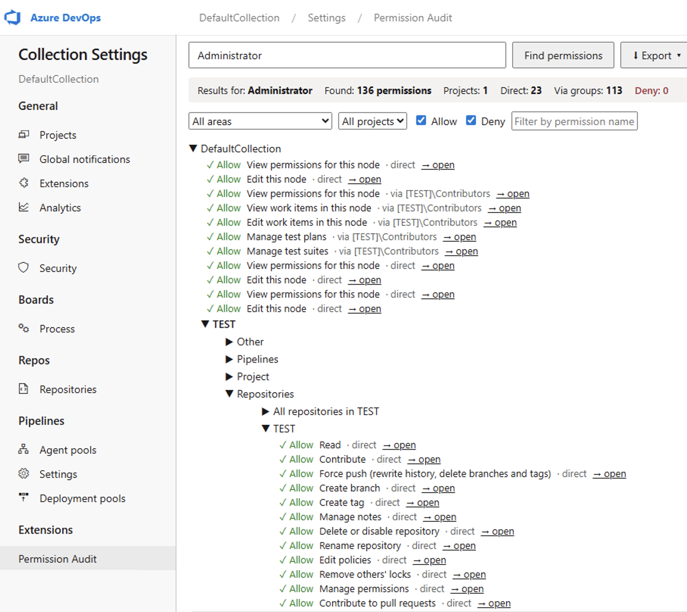

  

# Permission Audit — Azure DevOps Server 2022 extension

Finds **all permissions** a user or group has across a collection — direct and
inherited through (nested) group membership — with a deep link to the security
page where each permission is granted. For Project Collection Administrators.

## Features

- Single search box with autocomplete over users **and** groups (USER/GROUP badges)
- Full effective-permission scan: every security namespace (Git, Build, Release, Project, Area paths, Wiki, Dashboards, Service connections, …)
- Transitive group expansion — permissions inherited through nested AD groups, each row labeled `direct` or `via <group>`
- Results tree: Collection → Project → Resource type → Resource, with a **→ open** deep link to the exact security page for every permission
- Summary strip with a highlighted **Deny** counter, filters by area / project / effect / permission name
- Export of the filtered list to CSV, Excel, or JSON (formula-injection hardened)
- Resilient: per-area failures become warnings instead of crashing the scan; 429/503 retries

## Install (download a release)

1. Download the `.vsix` from the [latest release](../../releases/latest).
2. Open `https://{server}/{collection}/_gallery/manage` (the local collection gallery).
3. Click **Upload extension** and select the `.vsix`.
4. Install the extension into the target collection.
5. Open **Collection Settings** — **Permission Audit** appears in the sidebar (Extensions group). Hard-refresh (Ctrl+F5) if it does not show up immediately.

> If the page shows `Error issuing session token: HostAuthorizationNotFound`,
> uninstall the extension from the collection and install it again from the
> gallery — this recreates the host authorization record.

## Use

1. Type a user or group name (2+ characters); pick from the autocomplete.
   The **Find permissions** button stays disabled until a suggestion is selected.
2. Click **Find permissions**. Progress is shown step by step; large
   collections can take 10–30 s.
3. Browse the tree. Each row shows Allow/Deny, the permission, its source
   (direct or via a group), and an **→ open** link to the page where the
   permission is managed. The summary shows whose results are displayed.
4. Filter by area, project, effect, or permission name. **Export** the filtered
   list as CSV, Excel, or JSON.

Only Project Collection Administrators can use the tool — others get a clear
permission message.

## Build from source

    npm install
    npm test
    npm run package        # produces out/local.azpermission-helper-<version>.vsix

## Known limitations (v1)

- Collections with more than 1,000 projects are truncated (no pagination yet).
- Area/Iteration path links point to the project security page, not the node itself.
- Tree expansion and the export menu are mouse-only (no keyboard navigation yet).
